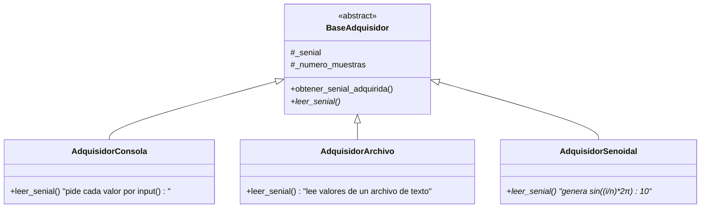

# 📡 Adquisición Señal - Factory Pattern + Configuración Externa

**Versión**: 3.1.0
**Autor**: Victor Valotto
**Responsabilidad**: Capturar datos de entrada y almacenarlos en una señal

## 📋 Descripción

Contiene el contrato común (`BaseAdquisidor`) que deben cumplir todos los adquisidores, sus implementaciones concretas y `FactoryAdquisidor`, que las crea a partir de un tipo y una configuración externa (`config.json`, vía `Configurador`).

## 🎯 Principios SOLID Aplicados

- **SRP**: cada adquisidor tiene una única forma de obtener datos.
- **OCP**: agregar un adquisidor nuevo (como `AdquisidorSenoidal`) no modifica `BaseAdquisidor` ni al `Lanzador`.
- **LSP**: cualquier `BaseAdquisidor` es intercambiable — todos reciben la señal por constructor y la llenan con `leer_senial()`.
- **DIP**: la señal se recibe inyectada (no se crea adentro), y el tipo concreto lo decide `FactoryAdquisidor` a partir de configuración externa, no un `if/elif` fijo en el cliente.

## 🏗️ Arquitectura



## 📦 Implementaciones Disponibles

### `BaseAdquisidor`

```python
class BaseAdquisidor(metaclass=ABCMeta):
    def __init__(self, numero_muestras, senial): ...
    def obtener_senial_adquirida(self): ...
    @abstractmethod
    def leer_senial(self): ...
```

### `AdquisidorConsola`

Pide cada valor por consola (`input()`), tantas veces como `numero_muestras`.

### `AdquisidorArchivo`

```python
AdquisidorArchivo(ruta_archivo, senial)
```

Lee los valores de un archivo de texto, uno por línea.

### `AdquisidorSenoidal`

Genera una señal senoidal sintética (`sin((i/n) * 2π) * 10`), sin entrada externa — útil para probar el sistema sin datos reales.

## 🏭 Factory Pattern - Inyección de Dependencias

```python
class FactoryAdquisidor:
    @staticmethod
    def crear(tipo: str, config: dict, senial) -> BaseAdquisidor:
        # tipo: "consola" | "archivo" | "senoidal"
        ...
```

`FactoryAdquisidor` no decide qué señal usar — la recibe ya creada (por `FactorySenial`, vía `Configurador`). Su única responsabilidad es ensamblar el adquisidor correcto según `tipo`.

## 🚀 Instalación

```bash
# Como paquete independiente
pip install -e ./adquisicion_senial

# Dependencias
# dominio_senial
```

## 💻 Uso y Ejemplos

### Polimorfismo

```python
from dominio_senial import SenialLista
from adquisicion_senial import AdquisidorConsola, AdquisidorArchivo

def leer_y_mostrar(adquisidor):
    adquisidor.leer_senial()
    return adquisidor.obtener_senial_adquirida()

# Mismo código funciona con cualquier adquisidor
leer_y_mostrar(AdquisidorConsola(5, SenialLista(5)))
leer_y_mostrar(AdquisidorArchivo('senial.txt', SenialLista(10)))
```

### Con el Factory (configuración externa)

```python
from adquisicion_senial import FactoryAdquisidor
from dominio_senial import FactorySenial

config = {"tipo": "senoidal", "num_muestras": 20}
senial = FactorySenial.crear("lista", {"tamanio": 20})
adquisidor = FactoryAdquisidor.crear(config["tipo"], config, senial)
adquisidor.leer_senial()
```

### Extensión (OCP)

Agregar un adquisidor nuevo no toca `BaseAdquisidor`, `Lanzador` ni `Configurador` — solo se agrega la clase concreta y una rama en `FactoryAdquisidor.crear()`.

## 🔗 Dependencias

- `dominio_senial` (contrato `SenialBase` que recibe inyectada).

## 🎯 Valor Didáctico

1. **DIP real**: el tipo de adquisidor lo decide `config.json`, no una condición hardcodeada en `Lanzador`.
2. **Inyección de señal**: `BaseAdquisidor` no crea su propia señal — la recibe, lo que permite variar tipo/tamaño desde afuera.
3. **OCP demostrado con un caso real**: `AdquisidorSenoidal` se agregó sin tocar ningún archivo existente salvo el Factory.
