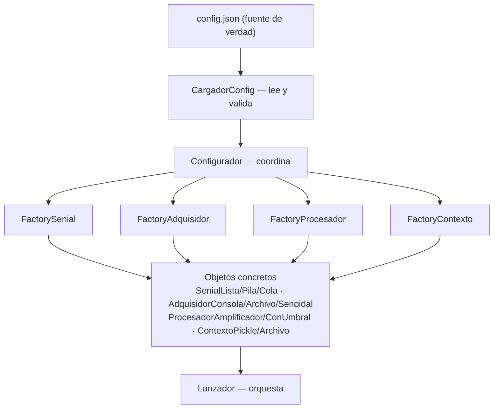

# Configurador - Factory Centralizado con Configuración Externa (DIP Aplicado)

**Versión**: 3.0.0
**Autor**: Victor Valotto
**Responsabilidad**: Leer `config.json` y delegar la creación de cada instancia concreta al Factory especializado correspondiente

## 📖 Descripción

Es el único paquete que conoce a todos los demás (`dominio_senial`, `adquisicion_senial`, `procesamiento_senial`, `presentacion_senial`, `persistidor_senial`). No decide ningún tipo concreto por sí mismo — lee `config.json` (vía `CargadorConfig`) y delega en el Factory de cada dominio.

## 🎯 Principios SOLID Aplicados

- **SRP**: una responsabilidad — traducir configuración externa en instancias configuradas.
- **DIP** ⭐: ningún `if/elif` decide tipos en este paquete; la configuración externa determina todas las dependencias del sistema.

## 🏗️ Arquitectura DIP



## 📋 API del Configurador

### Inicialización (obligatoria)

```python
Configurador.inicializar_configuracion()               # usa config.json del módulo
Configurador.inicializar_configuracion('/ruta/custom')  # o una ruta explícita
```

### Métodos disponibles

```python
Configurador.crear_senial_adquisidor()        # señal para el adquisidor, tipo desde JSON
Configurador.crear_senial_procesador()        # señal para el procesador, tipo desde JSON
Configurador.crear_adquisidor()               # tipo y parámetros desde JSON
Configurador.crear_procesador()               # tipo y parámetros desde JSON
Configurador.crear_visualizador()
Configurador.crear_repositorio_adquisicion()      # contexto desde JSON
Configurador.crear_repositorio_procesamiento()    # contexto desde JSON (independiente del anterior)
Configurador.crear_repositorio_fuente_senial()    # contexto desde JSON
```

## 📄 Archivo `config.json`

Se busca en el mismo directorio que el módulo `configurador` (`Path(__file__).parent`), sin importar desde dónde se ejecute el sistema.

```json
{
  "senial_adquisidor": { "tipo": "lista", "tamanio": 10 },
  "senial_procesador": { "tipo": "lista", "tamanio": 10 },
  "adquisidor": { "tipo": "archivo", "ruta_archivo": "senial.txt" },
  "procesador": { "tipo": "amplificador", "factor": 2.0 },
  "contexto_adquisicion": { "tipo": "pickle", "recurso": "./datos_persistidos/adquisicion" },
  "contexto_procesamiento": { "tipo": "pickle", "recurso": "./datos_persistidos/procesamiento" },
  "contexto_fuente_senial": { "tipo": "pickle", "recurso": "./datos_persistidos/fuente_senial" }
}
```

Ver `configurador/ejemplos/` para 6 configuraciones alternativas listas para copiar sobre `config.json`.

### Tipos soportados

| Sección | Tipos |
|---|---|
| `senial_adquisidor` / `senial_procesador` | `lista`, `pila`, `cola` |
| `adquisidor` | `consola`, `archivo`, `senoidal` |
| `procesador` | `amplificador`, `umbral` |
| `contexto_*` | `pickle`, `archivo` |

## 💡 Ejemplos de Uso

### Básico

```python
from configurador import Configurador

Configurador.inicializar_configuracion()

adquisidor = Configurador.crear_adquisidor()
procesador = Configurador.crear_procesador()
visualizador = Configurador.crear_visualizador()

adquisidor.leer_senial()
senial = adquisidor.obtener_senial_adquirida()
procesador.procesar(senial)
```

### Cambiar comportamiento sin modificar código

```json
// Antes: amplificador
"procesador": { "tipo": "amplificador", "factor": 2.0 }

// Después: umbral — sin tocar ningún .py
"procesador": { "tipo": "umbral", "umbral": 150 }
```

## 🏭 Factories Especializados Utilizados

- `FactorySenial` (`dominio_senial`)
- `FactoryAdquisidor` (`adquisicion_senial`)
- `FactoryProcesador` (`procesamiento_senial`)
- `FactoryContexto` (`persistidor_senial`)

## 🔧 Componentes del Paquete

### `Configurador`

Coordina: lee configuración, crea la señal correspondiente, delega en el Factory del dominio.

### `CargadorConfig`

Responsabilidad única: leer y validar `config.json`. No crea objetos, no toma decisiones de negocio.

## ✅ Beneficios del Enfoque DIP

1. **Configuración externa**: cambiar comportamiento es editar JSON, no código.
2. **Desacoplamiento total**: `Lanzador` no conoce ningún tipo concreto.
3. **Mantenibilidad**: cada Factory vive en el paquete de su propio dominio.
4. **Extensibilidad**: sumar un tipo nuevo es una clase + una rama de Factory + una opción de JSON.

## 📦 Instalación

```bash
pip install -e ./configurador
```

## 📚 Dependencias

- `dominio_senial`, `adquisicion_senial`, `procesamiento_senial`, `presentacion_senial`, `persistidor_senial`.

## 📖 Documentación Relacionada

- `docs/migracion_fichas/ficha_DIP.md` (repo `Senial_SOLID_IS`)
