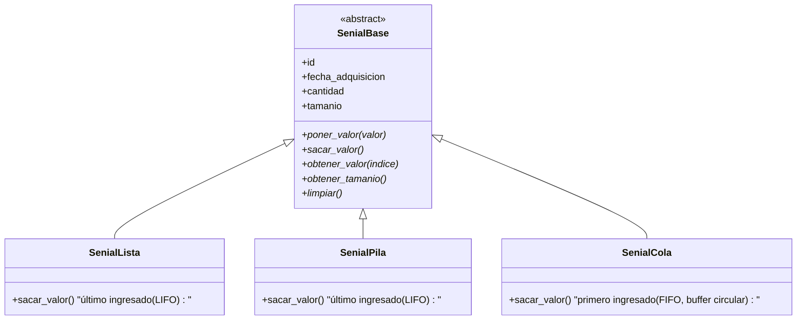
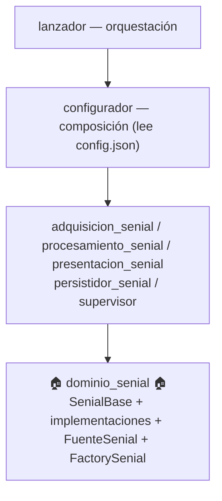

# 🏠 Dominio Señal - Entidades del Dominio

**Versión**: 3.2.0
**Autor**: Victor Valotto
**Responsabilidad**: Entidades fundamentales del dominio de señales digitales

Paquete independiente que implementa el **núcleo del dominio** en la arquitectura de procesamiento de señales. Es el centro estable del sistema: todos los demás paquetes dependen de él, y él no depende de ninguno.

## 📋 Descripción

Contiene la jerarquía de señales digitales y la entidad `FuenteSenial` (catálogo de orígenes de señal). No conoce nada sobre adquisición, procesamiento, persistencia ni configuración — solo el dominio puro.

## 🎯 Responsabilidad Única (SRP)

Una única razón para cambiar: modificaciones en las entidades del dominio de señales digitales (qué es una señal, qué es una fuente de señal).

## 🏗️ Arquitectura LSP



`SenialLista` y `SenialPila` comparten semántica de consumo (ambas LIFO) — el libro que guía este proyecto no las diferencia en ese aspecto; la lección de LSP es el contrato de `SenialBase`, no una semántica distinta por implementación.

## 📦 Entidades del Dominio

### `SenialBase`

```python
class SenialBase(ABC):
    def __init__(self, tamanio: int = 10): ...

    # Propiedades comunes
    id
    fecha_adquisicion
    cantidad
    tamanio

    @abstractmethod
    def poner_valor(self, valor: float) -> None: ...
    @abstractmethod
    def sacar_valor(self) -> Optional[float]: ...
    @abstractmethod
    def obtener_valor(self, indice: int) -> Optional[float]: ...
    @abstractmethod
    def obtener_tamanio(self) -> int: ...
    @abstractmethod
    def limpiar(self) -> None: ...
```

### `FuenteSenial`

Entidad mínima que representa el origen de una señal (sensor, archivo histórico, etc.):

```python
class FuenteSenial:
    def __init__(self, nombre: str = '', descripcion: str = ''): ...
    # id, nombre, descripcion
```

### `FactorySenial`

Crea la señal concreta a partir de un tipo y una configuración — el `Configurador` no decide `if/elif`, delega acá:

```python
class FactorySenial:
    @staticmethod
    def crear(tipo: str, config: dict) -> SenialBase: ...
```

## 🚀 Instalación

```bash
# Como paquete independiente
pip install -e ./dominio_senial

# O como parte del proyecto completo
pip install -e .
```

## 💻 Uso y Ejemplos

### Polimorfismo LSP

```python
from dominio_senial import SenialBase, SenialLista, SenialPila, SenialCola

def procesar_cualquier_senial(senial: SenialBase):
    senial.poner_valor(10.0)
    senial.poner_valor(20.0)
    print(f"Tamaño: {senial.obtener_tamanio()}")
    print(f"Extraído: {senial.sacar_valor()}")

for tipo in [SenialLista, SenialPila, SenialCola]:
    procesar_cualquier_senial(tipo())
```

### Factory Pattern

```python
from dominio_senial import FactorySenial

senial = FactorySenial.crear("cola", {"tamanio": 20})
```

## 🏗️ Posición en la Arquitectura



## ✅ Principios SOLID Aplicados

- **SRP**: una responsabilidad — entidades del dominio de señales.
- **OCP**: agregar un tipo de señal nuevo no modifica `SenialBase` ni sus consumidores.
- **LSP**: cualquier `SenialBase` es sustituible por otra sin romper al código cliente.
- **Independencia**: no depende de ningún otro paquete del sistema.

## 🔗 Integración con Otros Paquetes

```python
# adquisicion_senial y procesamiento_senial reciben la señal inyectada (DIP)
class BaseAdquisidor:
    def __init__(self, numero_muestras, senial: SenialBase): ...

class BaseProcesador:
    def __init__(self, senial: SenialBase): ...

# presentacion_senial trabaja contra la abstracción
class Visualizador:
    def mostrar_datos(self, senial: SenialBase, titulo: str) -> None: ...
```

## 🎯 Valor Didáctico

1. **LSP aplicado**: intercambiabilidad polimórfica real entre `SenialLista`/`SenialPila`/`SenialCola`.
2. **Contrato explícito**: `SenialBase` define qué debe cumplir cualquier señal, sin `isinstance`.
3. **DIP desde el dominio**: `FactorySenial` centraliza la decisión de tipo concreto, para que `Configurador` no la tenga hardcodeada.

## 📚 Documentación Relacionada

- `docs/migracion_fichas/ficha_LSP.md` (repo `Senial_SOLID_IS`)
- `docs/migracion_fichas/ficha_ISP.md` (entidad `FuenteSenial`)
