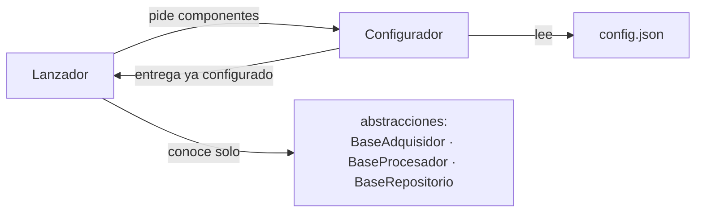
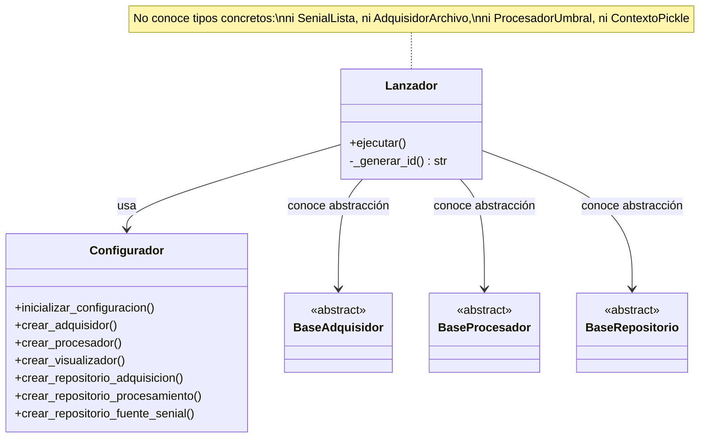
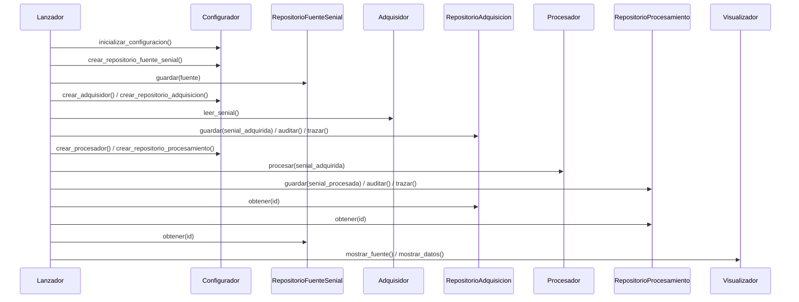

# Lanzador - Orquestador del Sistema con DIP Completo

**Versión**: 3.0.0
**Autor**: Victor Valotto
**Responsabilidad**: Orquestar el flujo completo del sistema, sin decidir ninguna configuración

## 📋 Descripción

Punto de entrada del sistema. Coordina fuente → adquisición → procesamiento → persistencia → visualización, sin conocer ningún tipo concreto: todas las dependencias las determina `config.json` a través de `Configurador`.

## 🎯 DIP Completo Aplicado

### ¿Qué se configura desde JSON?

- Tipo de señal (adquirida y procesada, independientes)
- Tipo de adquisidor
- Tipo de procesador
- Tipo de contexto de persistencia (adquisición, procesamiento y fuente de señal, independientes)

### Arquitectura DIP



### Beneficio principal

`Lanzador.ejecutar()` no cambia si el JSON cambia `SenialLista` por `SenialCola`, `AdquisidorArchivo` por `AdquisidorSenoidal`, o `ContextoPickle` por `ContextoArchivo`. El comportamiento del sistema varía; el código que lo orquesta no.

## 🎯 Responsabilidad Única (SRP)

### ✅ Lo que SÍ hace

- Orquesta la secuencia: fuente → adquirir → guardar → auditar → trazar → procesar → guardar → auditar → trazar → obtener → mostrar.
- Genera los IDs de las entidades a persistir (hash sobre `uuid4`).
- Pide los únicos datos que son de dominio, no de arquitectura (nombre/descripción de la fuente de señal).

### ❌ Lo que NO hace

- No decide qué tipo de señal, adquisidor, procesador o contexto usar (eso es `config.json` + `Configurador`).
- No contiene lógica de negocio de ningún componente.

## 🏗️ Arquitectura



## 📦 Contenido

### `Lanzador`

Única clase del paquete. Método público `ejecutar()`; `_generar_id()` es un detalle interno (hash `sha256` sobre `uuid4`, usado para identificar cada entidad persistida).

## 🚀 Instalación

```bash
pip install -e ./lanzador
```

## 💻 Uso

### Como script de consola

```bash
python -m lanzador.lanzador
```

### Como módulo Python

```python
from lanzador import Lanzador

Lanzador.ejecutar()
```

## 📊 Flujo de Ejecución



## ✅ Principios SOLID Demostrados

- **SRP**: única responsabilidad — orquestación.
- **OCP**: nuevos tipos de señal/adquisidor/procesador/contexto no tocan este archivo.
- **LSP**: trabaja contra `BaseAdquisidor`/`BaseProcesador`/`BaseRepositorio`, intercambiables sin condicionales.
- **ISP**: usa `auditar()`/`trazar()` solo sobre `RepositorioSenial` (que los tiene) — nunca sobre `RepositorioFuenteSenial`.
- **DIP** ⭐: todas las dependencias concretas las decide `config.json`, no este código.

## 🎯 Patrones de Diseño Aplicados

1. **Coordinador/Orquestador**: única responsabilidad, sin lógica de negocio propia.
2. **Factory Pattern** (indirecto, vía `Configurador`).
3. **Repository Pattern**: acceso a persistencia por `guardar()`/`obtener()`, no por detalles de almacenamiento.

## 🔗 Dependencias

- `dominio_senial` (`FuenteSenial`)
- `configurador` (`Configurador`)

## 📚 Documentación Relacionada

- `docs/migracion_fichas/ficha_DIP.md` (repo `Senial_SOLID_IS`)
