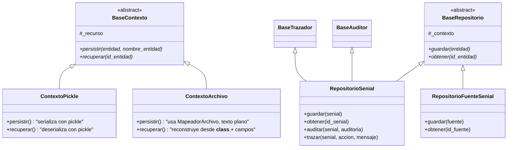

# Persistidor de Señales - Repository + Factory Pattern

**Versión**: 4.2.0
**Autor**: Victor Valotto
**Responsabilidad**: Persistir y recuperar entidades del dominio, separando la estrategia de almacenamiento (infraestructura) de la lógica de acceso (dominio)

## 📋 Descripción

Provee dos capas: `Contexto*` (infraestructura — cómo se guarda: pickle o archivo de texto) y `Repositorio*` (dominio — qué se guarda y con qué reglas: auditoría, trazabilidad). `FactoryContexto` crea la estrategia concreta a partir de configuración externa.

## 🏗️ Arquitectura - Repository Pattern con ISP



## ✅ Principios SOLID Aplicados

### 1. SRP

`BaseContexto` resuelve solo *cómo* persistir; `BaseRepositorio` resuelve solo *qué* persistir y con qué reglas de dominio.

### 2. OCP

Agregar una estrategia de persistencia nueva (ej. `ContextoJSON`) implica una clase + una rama en `FactoryContexto` — nada más cambia.

### 3. ISP

```python
# RepositorioSenial: necesita auditoría y trazabilidad
class RepositorioSenial(BaseAuditor, BaseTrazador, BaseRepositorio): ...

# RepositorioFuenteSenial: solo necesita persistencia básica
class RepositorioFuenteSenial(BaseRepositorio): ...
# hasattr(repo, 'auditar')  # False — ni siquiera existe
```

### 4. DIP

`BaseRepositorio` recibe un `BaseContexto` inyectado por constructor — no decide ni construye su propia estrategia de persistencia.

## 🏭 Factory Pattern - Creación Configurable

```python
class FactoryContexto:
    @staticmethod
    def crear(tipo: str, config: dict) -> BaseContexto:
        # tipo: "pickle" | "archivo"
        ...
```

### Uso típico (vía Configurador)

```python
# 1. Leer configuración externa (config.json)
config = cargador.obtener_config_contexto_adquisicion()
# {'tipo': 'archivo', 'recurso': './datos_persistidos/adquisicion'}

# 2. Factory crea el contexto según config
contexto = FactoryContexto.crear(config["tipo"], config)

# 3. Inyectar en el repositorio (DIP)
repositorio = RepositorioSenial(contexto)
```

## 🏗️ Componentes

### `BaseContexto` / `ContextoPickle` / `ContextoArchivo`

Gestionan el recurso físico (directorio) y saben `persistir(entidad, nombre_entidad)` / `recuperar(id_entidad)`. `ContextoArchivo` usa `MapeadorArchivo` para serializar campo a campo a texto plano, guardando el `__class__` de la entidad para reconstruirla sin necesitar una instancia molde.

### `Mapeador` / `MapeadorArchivo`

Serializa una entidad a texto (una línea por campo, `campo:valor` o `campo>indice:valor` para listas) y la reconstruye, infiriendo el tipo del valor persistido cuando el campo destino vale `None` (intenta `int` → `float` → `date` ISO → `str`).

### `BaseRepositorio` / `RepositorioSenial` / `RepositorioFuenteSenial`

`RepositorioSenial` implementa `guardar`/`obtener`/`auditar`/`trazar` con lógica real (auditoría y trazabilidad se escriben a `auditor.log`/`logger.log`). `RepositorioFuenteSenial` implementa solo `guardar`/`obtener` — sin auditoría ni trazabilidad, sin stubs.

## 📖 Uso

### Instalación

```bash
pip install -e ./persistidor_senial

# Dependencias
# supervisor
```

### Ejemplo básico — uso directo de contextos

```python
from persistidor_senial import ContextoPickle, ContextoArchivo
from dominio_senial import SenialLista

s = SenialLista(5)
s.id = "abc123"
s.poner_valor(1.0)

ctx = ContextoPickle('./datos/adquisicion')
ctx.persistir(s, s.id)
s_recuperada = ctx.recuperar(s.id)
```

### Ejemplo avanzado — Repository Pattern (recomendado)

```python
from persistidor_senial import RepositorioSenial, RepositorioFuenteSenial

repo_senial = RepositorioSenial(ctx)
repo_senial.guardar(s)
repo_senial.auditar(s, "Señal adquirida con 5 valores")
repo_senial.trazar(s, "ADQUISICION", "Lectura completada")
s_recuperada = repo_senial.obtener(s.id)
```

## 🎯 Dependencias

- `supervisor` (`BaseAuditor`, `BaseTrazador`).

## 📚 Casos de Uso

1. Persistencia de la señal adquirida (formato configurable: texto plano o pickle).
2. Persistencia de la señal procesada, en un contexto/recurso independiente del de la adquirida.
3. Persistencia del catálogo de fuentes de señal (`RepositorioFuenteSenial`), sin auditoría ni trazabilidad.
4. Intercambio de estrategias sin tocar el repositorio: mismo `RepositorioSenial`, distinto `Contexto` inyectado.

## 📖 Documentación Relacionada

- `docs/migracion_fichas/ficha_ISP.md` (repo `Senial_SOLID_IS`)
- `docs/migracion_fichas/ficha_DIP.md` (repo `Senial_SOLID_IS`)
