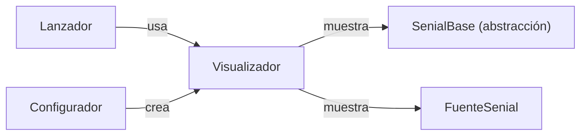

# 📊 Presentación Señal - Visualización Polimórfica

**Versión**: 2.1.0
**Autor**: Victor Valotto
**Responsabilidad**: Mostrar en consola los datos de una señal o de una fuente de señal

## 📋 Descripción

Contiene `Visualizador`, la única clase del paquete. No decide qué mostrar más allá de los datos de la entidad que recibe — no conoce tipos concretos de señal.

## 🎯 Principios SOLID Aplicados

- **SRP**: una única responsabilidad — presentar datos en consola.
- **LSP**: `mostrar_datos()` funciona igual con `SenialLista`, `SenialPila` o `SenialCola`, sin `isinstance`.
- **DIP**: depende de `SenialBase`/`FuenteSenial` (abstracciones de dominio), no de implementaciones concretas.

## 📦 Contenido

### `Visualizador`

```python
class Visualizador:
    def mostrar_datos(self, senial: SenialBase, titulo: str) -> None:
        # imprime id, fecha_adquisicion, cantidad, tamanio y valores
        ...

    def mostrar_fuente(self, fuente: FuenteSenial, titulo: str) -> None:
        # imprime id, nombre y descripcion
        ...
```

## 🚀 Instalación

```bash
pip install -e ./presentacion_senial

# Dependencias
# dominio_senial
```

## 💻 Uso y Ejemplos

### Polimorfismo LSP

```python
from dominio_senial import SenialLista, SenialPila, SenialCola
from presentacion_senial import Visualizador

visualizador = Visualizador()

for tipo in [SenialLista, SenialPila, SenialCola]:
    senial = tipo(5)
    senial.poner_valor(1.0)
    visualizador.mostrar_datos(senial, f"{tipo.__name__}:")
```

### Fuente de señal

```python
from dominio_senial import FuenteSenial
from presentacion_senial import Visualizador

fuente = FuenteSenial("sensor-temp", "Sensor de temperatura de planta")
Visualizador().mostrar_fuente(fuente, "Fuente registrada:")
```

## 🏗️ Integración con el Sistema



El `Configurador` decide qué tipo de señal se usa; el `Visualizador` nunca necesita saberlo.

## 🔗 Dependencias

- `dominio_senial` (`SenialBase`, `FuenteSenial`).

## 🎯 Valor Didáctico

1. **LSP en la capa de presentación**: un solo método sirve para las tres implementaciones de señal.
2. **DIP**: el visualizador nunca importa una clase concreta de señal.
