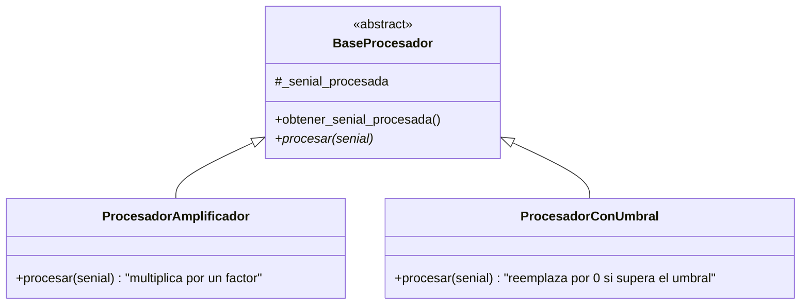

# ⚙️ Procesamiento Señal - Factory Pattern + Configuración Externa

**Versión**: 3.0.0
**Autor**: Victor Valotto
**Responsabilidad**: Transformar los valores de una señal según un algoritmo

## 📋 Descripción

Contiene el contrato común (`BaseProcesador`) que deben cumplir todos los procesadores, sus implementaciones concretas y `FactoryProcesador`, que las crea a partir de un tipo y una configuración externa.

## 🎯 Principios SOLID Aplicados

- **SRP**: cada procesador implementa un único algoritmo de transformación.
- **OCP**: agregar un procesador nuevo no modifica `BaseProcesador` ni al `Lanzador`.
- **LSP**: cualquier `BaseProcesador` es intercambiable — todos consumen la señal de entrada con `sacar_valor()` y acumulan en la señal procesada con `poner_valor()`.
- **DIP**: la señal procesada se recibe inyectada por constructor (no se crea `SenialLista()` hardcodeada adentro) — así `senial_procesador` en `config.json` tiene efecto real.

## 🏗️ Arquitectura



## 📦 Implementaciones Disponibles

### `BaseProcesador`

```python
class BaseProcesador(metaclass=ABCMeta):
    def __init__(self, senial): ...
    def obtener_senial_procesada(self): ...
    @abstractmethod
    def procesar(self, senial): ...
```

### `ProcesadorAmplificador`

```python
ProcesadorAmplificador(amplificacion, senial)
```

Cada valor de la señal de entrada se multiplica por `amplificacion`.

### `ProcesadorConUmbral`

```python
ProcesadorConUmbral(umbral, senial)
```

Cada valor se reemplaza por `0` si supera el `umbral`.

## 🏭 Factory Pattern

```python
class FactoryProcesador:
    @staticmethod
    def crear(tipo: str, config: dict, senial) -> BaseProcesador:
        # tipo: "amplificador" | "umbral"
        ...
```

## 🚀 Instalación

```bash
pip install -e ./procesamiento_senial

# Dependencias
# dominio_senial
```

## 💻 Uso y Ejemplos

### Polimorfismo

```python
from dominio_senial import SenialLista
from procesamiento_senial import ProcesadorAmplificador, ProcesadorConUmbral

senial = SenialLista(5)
for v in [1.0, 2.0, 3.0]:
    senial.poner_valor(v)

procesador = ProcesadorAmplificador(2.0, SenialLista(5))
procesador.procesar(senial)
print(procesador.obtener_senial_procesada())
```

### Con el Factory (configuración externa)

```python
from procesamiento_senial import FactoryProcesador
from dominio_senial import FactorySenial

config = {"tipo": "umbral", "umbral": 100}
senial_procesada = FactorySenial.crear("lista", {"tamanio": 10})
procesador = FactoryProcesador.crear(config["tipo"], config, senial_procesada)
```

## 🔗 Dependencias

- `dominio_senial` (contrato `SenialBase` que recibe inyectada).

## 🎯 Valor Didáctico

1. **DIP real**: `senial_procesador` en `config.json` solo tiene efecto porque `BaseProcesador` recibe la señal por constructor.
2. **OCP**: sumar un algoritmo nuevo (ej. un filtro) implica una clase nueva + una rama en el Factory, nada más.
