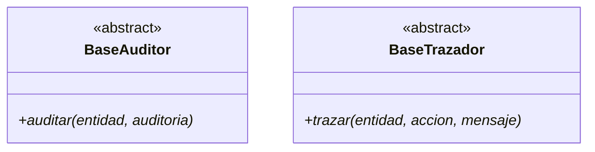
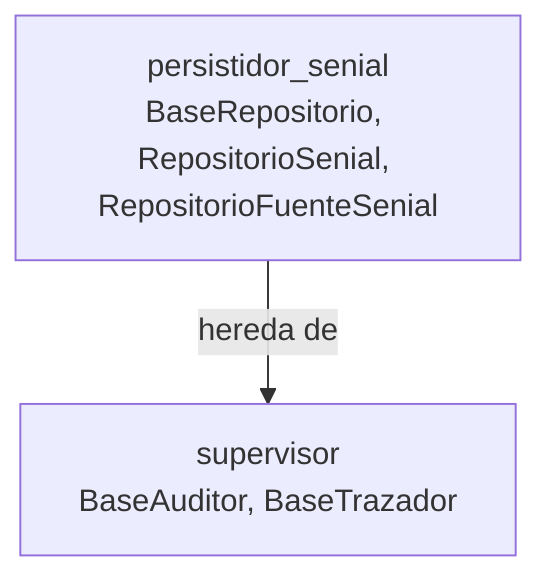

# Supervisor - Interfaces Segregadas para Auditoría y Trazabilidad

**Versión**: 1.0.0
**Autor**: Victor Valotto
**Responsabilidad**: Definir los contratos de supervisión del sistema (qué significa auditar, qué significa trazar)

## 📋 Descripción

Paquete nuevo, separado de `persistidor_senial`. No persiste datos ni procesa señales — su única responsabilidad es declarar las interfaces de supervisión que algunos repositorios necesitan y otros no.

## 🎯 Problema que Resuelve

### ❌ Antes: interfaz gorda en `BaseRepositorio`

```python
class BaseRepositorio(ABC):
    def guardar(self, entidad): ...
    def obtener(self, id_entidad): ...
    def auditar(self, entidad, auditoria): ...   # no todos lo necesitan
    def trazar(self, entidad, accion, mensaje): ...  # no todos lo necesitan

# RepositorioFuenteSenial forzado a stubs NotImplementedError
```

### ✅ Después: interfaces segregadas

```python
class BaseRepositorio(ABC):
    def guardar(self, entidad): ...
    def obtener(self, id_entidad): ...

class RepositorioSenial(BaseAuditor, BaseTrazador, BaseRepositorio):
    ...  # declara explícitamente las 3 capacidades que necesita

class RepositorioFuenteSenial(BaseRepositorio):
    ...  # solo persistencia — sin auditar/trazar, sin stubs
```

## 🏗️ Componentes



### `BaseAuditor`

```python
class BaseAuditor(ABC):
    @abstractmethod
    def auditar(self, entidad: Any, auditoria: str) -> None: ...
```

### `BaseTrazador`

```python
class BaseTrazador(ABC):
    @abstractmethod
    def trazar(self, entidad: Any, accion: str, mensaje: str) -> None: ...
```

## 🚀 Instalación

```bash
pip install -e ./supervisor
```

## 💻 Uso

### Composición en un repositorio concreto

```python
from supervisor import BaseAuditor, BaseTrazador
from persistidor_senial import BaseRepositorio

class RepositorioSenial(BaseAuditor, BaseTrazador, BaseRepositorio):
    def guardar(self, senial): ...
    def obtener(self, id_senial): ...
    def auditar(self, senial, auditoria):
        with open('auditor.log', 'a') as f:
            f.write(f'{senial.id} | {auditoria}\n')
    def trazar(self, senial, accion, mensaje):
        with open('logger.log', 'a') as f:
            f.write(f'{senial.id} | {accion} | {mensaje}\n')
```

### Verificación negativa de ISP

```python
repo_fuente = RepositorioFuenteSenial(contexto)
hasattr(repo_fuente, 'auditar')  # False — ni siquiera existe el método
hasattr(repo_fuente, 'trazar')   # False
```

## ✅ Principios SOLID Demostrados

- **ISP** ⭐: ningún repositorio implementa un método que no necesita.
- **SRP**: la responsabilidad de "qué es auditar/trazar" vive en su propio paquete, separada de "cómo persistir".
- **DIP**: `RepositorioSenial` depende de las abstracciones `BaseAuditor`/`BaseTrazador`, no de una implementación concreta de logging.
- **OCP**: se puede agregar `BaseNotificador` (u otra capacidad de supervisión) sin tocar los repositorios que no la necesitan.

## 🔗 Integración con el Proyecto



## 🎓 Valor Didáctico

1. **Segregación de interfaces**: cada interfaz tiene un único método, una única razón de ser.
2. **Composición sobre herencia simple**: `RepositorioSenial` declara sus capacidades vía herencia múltiple explícita, no por convención implícita.
3. **Dependencias opcionales**: un repositorio elige qué capacidades tiene heredando solo lo que necesita.

## 📚 Referencias

- `docs/migracion_fichas/ficha_ISP.md` (repo `Senial_SOLID_IS`)
